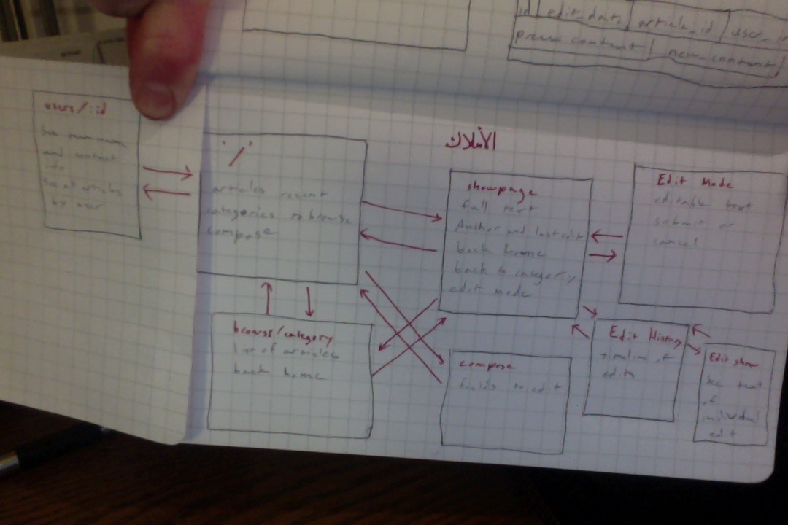
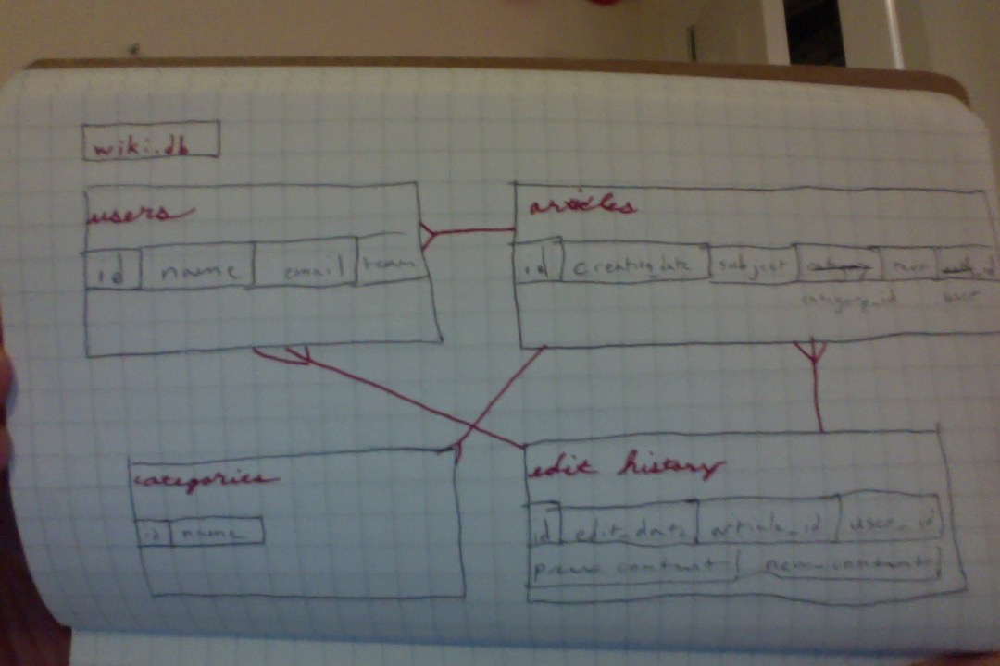

#Henriettapedia
###A wiki customized for the intra-office needs of the unnamed rapaciously tentacular mega-corporation helmed by the merciless magnate Henrietta herself.

####1. App spec.

  * Root Directory
    * User sees a list of recently active articles.
    * The user can select a category from a dropdown menu of articles to browse.
    * What's more, the user is given the option of composing an article.
    * Lastly, the user can click any article title to be taken to its showpage.
  * '/categories/:id'
    * User sees a list of articles for a given category organized by time of most recent activity.
    * User can click any article title to be taken to its showpage.
    * User can return to the root directory.
  * '/users/:id'
    * User can see email and other professional information.
    * User can peruser a list of this user's articles.
  * articles/:id'
    * User is able to read the full text of the article.
    * User is able to see the edit history of the article.
    * User can access edit mode for the article.
    * User can return to the root.
    * User can return to /categories/:id
  * articles/:id/edit
    * User can access the article body in a text box.
    * User can save changes or cancel--either event returns the user to the article showpage.
  * articles/:id/edits
    * User accesses a timeline of the article's edits.
  * articles/:id/edits/:editid
    * User sees the text of the article as it existed after the selected edit.

####2. Wire Frame


####3. ERD


####4. Modules used
  * expressjs is a lightweight web framework written with node's http library.
  * sqlite3 is a node module for running SQLite commands.
  * Mustache does front-end templating.
  * marked parses a markdown string and spits out html.
  * morgan does server logging.
  * body-parser parses the body of a post request.
  * method-override allows html forms to issue put and delete requests.
  * henri is a module of constructor functions which make interacting with wiki.db more pleasant.

####5. Instructions for deployment
  * Clone the git repository.
  * In the repository root directory, run
  ```bash
  $ npm install
  ```
  * Touch a database file called wiki.db
  ```bash
  $ touch wiki.db
  ```
  * Run the schema and seed files
  ```bash
  $ node schema.js
  $ node seed.js
  ```
  * Now the app is ready to deploy.
  ```bash
  $ node app.js
  ```

####5. Link to the project.
[DO]: http://104.131.60.34:3000/
[This is the link to the project][DO]
